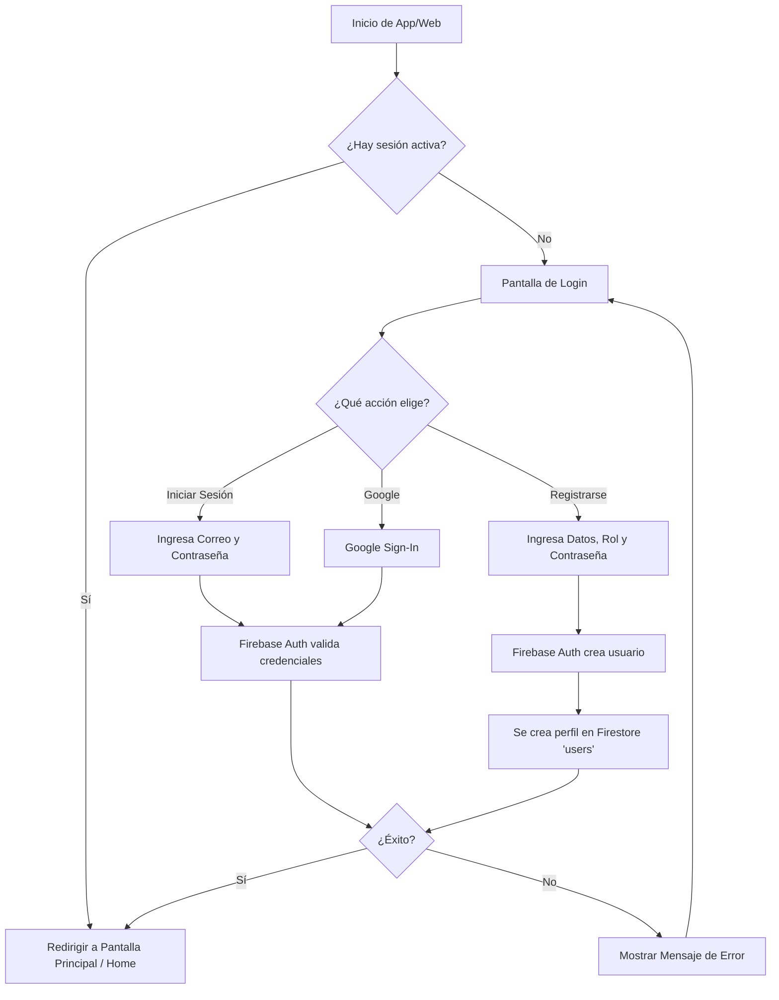
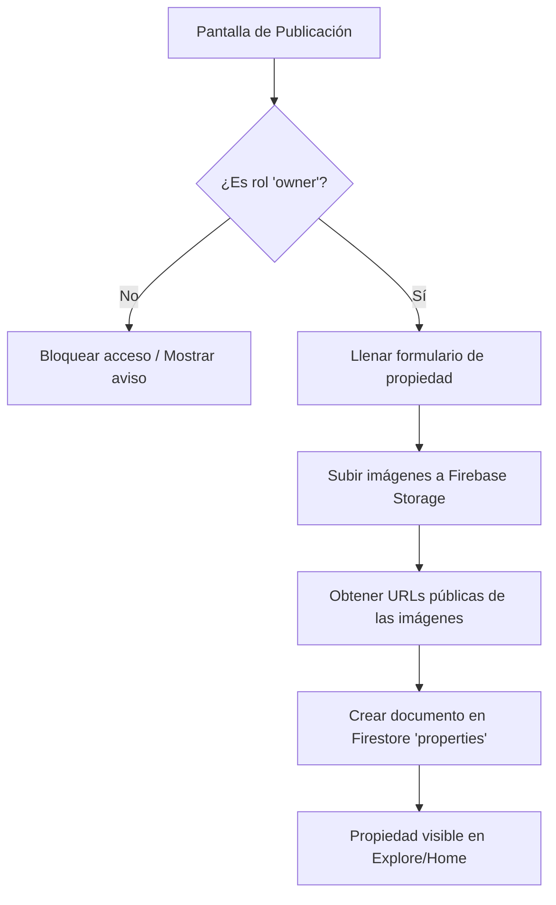
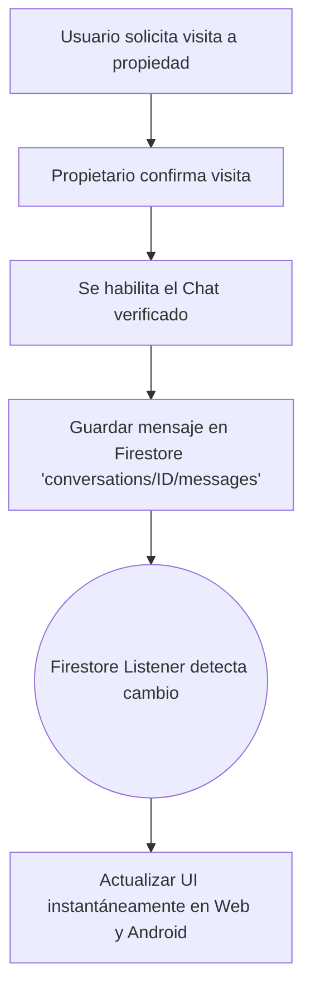

# Documentación Técnica del Proyecto: RuwaJay

## 1. Introducción
**RuwaJay** es una plataforma integral (Aplicación Web y Aplicación Android) diseñada para conectar a buscadores de vivienda con propietarios. Permite explorar propiedades, ver ubicaciones en mapas, coordinar visitas, navegar en tiempo real con Waze y comunicarse mediante un chat integrado.

---

## 2. Arquitectura del Sistema
El proyecto sigue una arquitectura **Serverless** (sin servidor propio) respaldada al 100% por los servicios de Firebase y APIs públicas gratuitas, garantizando alta disponibilidad, tiempo real y un modelo libre de costos de infraestructura.

*   **Frontend Web:** React.js + Vite + TailwindCSS.
*   **Frontend Android:** Kotlin + Jetpack Compose + Navigation Compose.
*   **Autenticación:** Firebase Authentication (Correo/Contraseña y Google Sign-In).
*   **Base de Datos:** Firebase Firestore (NoSQL en tiempo real).
*   **Almacenamiento (Archivos/Imágenes):** Firebase Storage.
*   **Mapas y Navegación:** Leaflet.js (Web), osmdroid (Android) y OSRM Engine (Cálculo de rutas).

---

## 3. Diagramas de Flujo (Lógica Principal)

### 3.1. Flujo de Autenticación (Login / Registro)
Este flujo describe cómo un usuario accede a la plataforma de forma segura.

### 3.2. Flujo de Publicación de Propiedades (Rol Propietario)
Cómo un propietario añade una nueva vivienda a la plataforma.

### 3.3. Flujo del Chat en Tiempo Real
Comunicación instantánea entre Buscador y Propietario tras la confirmación de visita.

---

## 4. Módulo de Navegación en Vivo y Waze (OSRM Engine)
RuwaJay incorpora un sistema de navegación inteligente integrado tanto en la versión web como en la aplicación Android:
*   **Cálculo de Rutas Reales:** Utiliza OSRM (Open Source Routing Machine) para calcular rutas de conducción y caminata basadas en viales reales.
*   **Semáforo de Tráfico:** Segmentación de la ruta con código de colores (Verde: Fluido, Amarillo: Moderado, Rojo: Pesado).
*   **Simulación de Trayecto:** Reproductor interactivo de simulación de vehículo sobre el mapa.
*   **Enlaces Externos:** Botones directos para abrir la ruta en la aplicación oficial de Waze o Google Maps.

---

## 5. Estructura de Datos (Firestore)
La base de datos NoSQL está dividida en las siguientes colecciones principales:

*   **`users`**: Perfiles de usuarios (nombre, correo, rol: *seeker* o *owner*, foto, teléfono).
*   **`properties`**: Anuncios de inmuebles (título, descripción, precio, ubicación, IDs de imágenes, ID del propietario, coordenadas).
*   **`conversations`**: Salas de chat (participantes, último mensaje, fecha de actualización).
    *   Subcolección **`messages`**: Historial de chat (texto, emisor, timestamp).
*   **`system_updates`**: Avisos globales de la plataforma.

---

## 6. Decisiones Técnicas y Costos
*   **Cero Costos de Servidor:** Se descartó el uso de un backend propio para evitar el mantenimiento de servidores y costos asociados. Todo opera mediante Firebase de forma Serverless.
*   **Autenticación:** Se utiliza exclusivamente Correo/Contraseña y Google para evitar los límites y cobros asociados al envío de SMS de Firebase.
*   **Sincronización:** Tanto la app Android como la Web escuchan la misma base de datos Firestore, lo que asegura que si un usuario manda un mensaje o agenda una cita, se actualiza instantáneamente en ambas plataformas.

---
*Documento generado automáticamente para el proyecto RuwaJay.*
