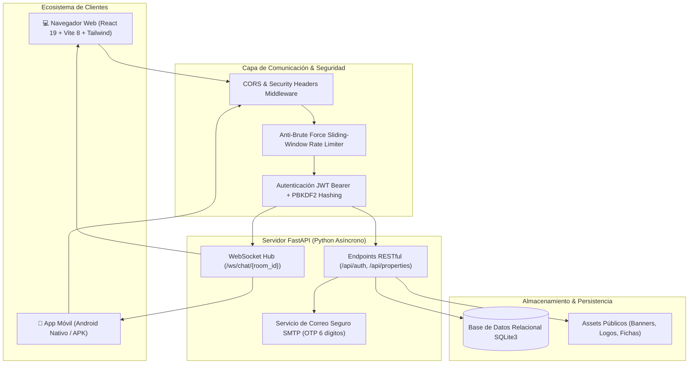

<div align="center">

  

  # 🏡 Ruwa Jay (RuwaJay)
  ### *Tu Hogar, Tu Camino · Plataforma Integral de Vivienda y Alquiler Residencial en Guatemala*

  [](https://react.dev/)
  [](https://vitejs.dev/)
  [](https://tailwindcss.com/)
  [](https://fastapi.tiangolo.com/)
  [](https://www.python.org/)
  [](https://sqlite.org/)
  [](https://developer.mozilla.org/es/docs/Web/API/WebSockets_API)
  [](#-descarga-de-la-aplicación-móvil-ruwajay-app)

  <p align="center">
    <b>Plataforma web y móvil de última generación diseñada para transformar la experiencia de búsqueda, comparación, negociación y arrendamiento de casas y apartamentos en Guatemala 🇬🇹.</b>
  </p>

  <p align="center">
    <a href="#-características-del-sistema">Funcionalidades</a> •
    <a href="#-descarga-de-la-aplicación-móvil-ruwajay-app"><b>Descargar App Móvil</b></a> •
    <a href="#-arquitectura-y-stack-tecnológico">Arquitectura</a> •
    <a href="#-instalación-y-despliegue-local">Instalación</a> •
    <a href="#-documentación-de-la-api">API</a> •
    <a href="#-seguridad-y-normativas">Seguridad</a>
  </p>

</div>

---

## 📖 Tabla de Contenidos

1. [Acerca del Proyecto](#-acerca-del-proyecto)
2. [Características Principales del Ecosistema Web](#-características-principales-del-ecosistema-web)
3. [📱 Descarga de la Aplicación Móvil (RuwaJay App)](#-descarga-de-la-aplicación-móvil-ruwajay-app)
4. [Arquitectura y Stack Tecnológico](#-arquitectura-y-stack-tecnológico)
5. [Estructura del Repositorio](#-estructura-del-repositorio)
6. [Instalación y Despliegue Local](#-instalación-y-despliegue-local)
7. [Documentación de la API Backend](#-documentación-de-la-api-backend)
8. [Seguridad y Buenas Prácticas](#-seguridad-y-buenas-prácticas)
9. [Flujo de Experiencia de Usuario](#-flujo-de-experiencia-de-usuario)
10. [Roadmap y Futuras Funcionalidades](#-roadmap-y-futuras-funcionalidades)
11. [Créditos y Licencia](#-créditos-y-licencia)

---

## 🌟 Acerca del Proyecto

**RuwaJay** (inspirado en raíces ancestrales y vocación comunitaria) es un ecosistema tecnológico integral enfocado en conectar a personas que buscan un nuevo hogar con propietarios legítimos y administradores de inmuebles a lo largo de toda la República de Guatemala (Ciudad de Guatemala, Mixco, Villa Nueva, Antigua Guatemala, Quetzaltenango, Atitlán, entre otras).

### 🎯 Problemas que resuelve:
* **Falta de transparencia en alquileres:** Precios transparentes y sin tarifas ocultas en Quetzales (GTQ) y Dólares (USD).
* **Inseguridad en visitas presenciales:** Herramienta exclusiva de *Ruta Segura*, estimación de trayecto vial y enlace de compartición con contactos de confianza.
* **Procesos manuales y contratos ambiguos:** Generador legal y visualizador interactivo de contratos de arrendamiento conforme al Código Civil guatemalteco.
* **Dificultad para calcular el presupuesto real:** Calculadora financiera de asequibilidad de renta basada en ingresos y la regla 30/35.
* **Comunicación dispersa:** Chat en tiempo real vía WebSockets con notificaciones directas entre inquilinos y propietarios.

---

## 🚀 Características Principales del Ecosistema Web

### 1. 🔍 Exploración Inteligente & Filtros Avanzados
* **Búsqueda multinivel:** Filtrado por departamentos, municipios y zonas guatemaltecas (Zona 10, Zona 14, Zona 15, Carretera a El Salvador, etc.).
* **Parámetros refinados:** Rango de precios mensual, número de habitaciones, baños, parqueos, dimensiones en m² y políticas específicas (mascotas permitidas, amueblado, garita con seguridad privada, cisterna, jardín).
* **Modos de visualización:** Alterna en un solo clic entre la vista en cuadrícula de tarjetas de alta fidelidad y el mapa interactivo.

### 2. 🗺️ Mapa Interactivo Geoespacial (Leaflet & OpenStreetMap)
* Marcadores personalizados de alta precisión con previsualización rápida de la propiedad al hacer clic.
* Centrado geográfico inteligente sobre los principales nodos urbanos y turísticos de Guatemala.

### 3. 📍 Ruta Segura & Navegación para Visitas Presenciales
* Detección de geolocalización en tiempo real del usuario.
* Cálculo automático de distancias kilométricas y tiempos estimados de llegada en vehículo o a pie.
* **Conexión directa a navegación GPS:** Enlaces nativos listos para abrir la ruta en **Waze** o **Google Maps**.
* **Compartir Ruta de Seguridad:** Permite enviar mediante un solo toque el enlace de la ruta y ubicación a una persona de confianza antes de acudir a ver un inmueble.

### 4. 💬 Chat Instantáneo en Tiempo Real (WebSockets)
* Canal de comunicación bi-direccional instantáneo entre inquilinos y propietarios/anfitriones.
* Notificaciones flotantes (*toast alerts*) en vivo para mensajes entrantes mientras navegas por la plataforma.
* Historial de mensajes persistente en la interfaz con estado de conexión.

### 5. ⚖️ Comparador Cara a Cara de Propiedades
* Modal comparador interactivo para evaluar hasta 4 propiedades simultáneamente.
* Matriz comparativa de métricas clave: precio total, precio por metro cuadrado, amenidades incluidas, reglas de convivencia y puntuaciones de la comunidad.

### 6. 💰 Calculadora Financiera de Asequibilidad de Renta
* Evalúa los ingresos mensuales del usuario y su carga crediticia actual.
* Sugiere el rango óptimo de presupuesto mensual para evitar sobreendeudamiento, aplicando estándares financieros de bienestar habitacional.

### 7. 📝 Generador y Visor de Contratos de Arrendamiento
* Visualización estructurada de borradores de contratos de alquiler residencial.
* Cláusulas de fianza/depósito en garantía, mantenimiento, penalizaciones por mora y responsabilidades de las partes.

### 8. ⭐ Sistema de Reseñas y Calificaciones Comunitarias
* Valoración desagregada por limpieza, veracidad del anuncio, comunicación del anfitrión, ubicación y relación calidad-precio.

### 9. 📢 Módulo de Publicación para Propietarios
* Formulario intuitivo paso a paso para dar de alta inmuebles con fotografías, descripción enriquecida, amenidades, geolocalización y precio mensual estipulado.

---

## 📱 Descarga de la Aplicación Móvil (RuwaJay App)

Lleva la experiencia completa de RuwaJay en tu bolsillo. La aplicación móvil te permite recibir notificaciones instantáneas de nuevos mensajes o visitas agendadas, navegar hacia las propiedades mediante GPS y acceder a tus alquileres incluso en modo sin conexión.

<div align="center">

| Plataforma | Estado | Enlace de Descarga | Versión |
| :--- | :--- | :--- | :--- |
| **Android (.APK Directo)** | 🟢 Disponible | [📥 **Descargar RuwaJay APK (V2.4.0)**](#) | v2.4.0 (Build 42) |
| **Google Play Store** | 🟡 Acceso Anticipado | [📲 **Obtener en Google Play**](#) | Beta Pública |
| **Apple App Store (iOS)** | ⚪ Próximamente | [🍎 *Solicitar Acceso TestFlight*](#) | Q4 2026 |

<br />

```
  ┌─────────────────────────────────────────────────────────────┐
  │                   📲 RUWAJAY MOBILE APP                     │
  │                                                             │
  │   [ Escanea el código QR desde tu teléfono para descargar ]  │
  │                                                             │
  │         ▄▄▄▄▄▄▄  ▄   ▄▄ ▄▄▄▄▄▄▄                             │
  │         █ ▄▄▄ █ ▀█ ▄███ █ ▄▄▄ █                             │
  │         █ ███ █ ▀█▄▄  █ █ ███ █                             │
  │         █▄▄▄▄▄█ █ █ █ █ █▄▄▄▄▄█                             │
  │         ▄▄▄▄  ▄ ▄▄▄█▀▀▄  ▄▄▄ ▄                              │
  │         ███ ▀▄▄▀▄ ▄█▄ ▀██ ▀ ▄█▄                             │
  │         ▄▄▄▄▄▄▄ █▄█ ▄▀█ █ █ █ █                             │
  │         █ ▄▄▄ █  ▀█▄▀▄█ █▄▄▄█ █                             │
  │         █ ███ █ █▀  █▄  ▄▄▄ █▄█                             │
  │         █▄▄▄▄▄█ █▀█ ▀▄▀ ▀█ ▄  █                             │
  │                                                             │
  │         Compatible con Android 8.0+ Oreo en adelante         │
  └─────────────────────────────────────────────────────────────┘
```

</div>

### ✨ Ventajas exclusivas de la App Móvil:
* **🔔 Notificaciones Push instantáneas:** Entérate al segundo de respuestas de propietarios, reducciones de precio en tus favoritos o confirmaciones de visitas.
* **📷 Carga Rápida desde la Cámara:** Los propietarios pueden tomar fotos directamente y publicar su propiedad en menos de 3 minutos.
* **📍 Navegación GPS Integrada:** Ruta paso a paso integrada sin salir de la app.
* **📴 Modo Guardado Offline:** Consulta direcciones, teléfonos y detalles de contratos guardados sin gastar tus datos móviles.

### 📋 Guía de Instalación del APK en Android:
1. Haz clic en el enlace **[Descargar RuwaJay APK](#)** desde tu smartphone.
2. Al finalizar la descarga, abre el archivo `.apk`.
3. Si el sistema lo solicita, autoriza la opción **"Instalar aplicaciones de fuentes desconocidas"** en la configuración de seguridad de tu navegador.
4. Presiona **Instalar** y ¡listo! Abre RuwaJay e inicia sesión con tu cuenta habitual.

---

## 🧠 Arquitectura y Stack Tecnológico



### 🛠️ Tecnologías Empleadas

| Área | Tecnologías / Librerías |
| :--- | :--- |
| **Frontend Web** | **React 19**, **Vite 8**, **Tailwind CSS v4**, **React Router v7** |
| **Animaciones & UI** | **Framer Motion**, **GSAP (@gsap/react)**, **Lucide Icons** |
| **Mapas & Geodatos** | **Leaflet**, **React-Leaflet**, OpenStreetMap Tiles |
| **Backend API** | **Python 3.10+**, **FastAPI**, **Uvicorn** (asíncrono ASGI) |
| **Base de Datos** | **SQLite3** con migraciones dinámicas y relaciones de usuario |
| **Seguridad** | **PBKDF2-HMAC-SHA256** (310,000 iteraciones), **Python-Jose** (JWT), **SimpleWebAuthn / WebAuthn** |
| **Tiempo Real** | **WebSockets** con gestión de salas de mensajería multi-cliente |
| **Correo Transaccional**| **smtplib** + plantillas HTML responsive para códigos de recuperación |
| **App Móvil** | **Android Kotlin / Jetpack Compose** & Distribución APK directa |

---

## 📂 Estructura del Repositorio

```text
RuwaJay/
├── backend/                  # Servidor Backend en Python FastAPI
│   ├── app/
│   │   ├── main.py           # API principal: Auth, Rate Limit, WebSockets, SMTP
│   │   └── ruwajay.db        # Base de datos SQLite local
│   └── requirements.txt      # Dependencias de Python
├── public/                   # Archivos estáticos servidos públicamente
│   ├── Banners/              # Banners promocionales en alta definición
│   ├── Casas/                # Fotografías de propiedades de muestra
│   └── logo/                 # Isotipo y logotipo oficial de RuwaJay
├── scripts/
│   └── dev.mjs               # Orquestador concurrente (inicia Backend + Frontend juntos)
├── src/                      # Código fuente del Frontend (React 19)
│   ├── assets/               # Recursos gráficos internos
│   ├── components/           # Componentes modulares reutilizables
│   │   ├── chat/             # Toasts y widgets de mensajería en vivo
│   │   ├── layout/           # Header, Footer institucional, navegación móvil
│   │   ├── map/              # Vistas de mapa interactivo con Leaflet
│   │   ├── property/         # Tarjetas, comparador, calculadoras, contratos, reviews
│   │   └── ui/               # Datepicker, Selectores personalizados, Loader de marca
│   ├── context/              # Context API: AuthContext, Favorites, Compare, Chat
│   ├── data/                 # Propiedades semilla, ubicaciones de Guatemala, avatares
│   ├── hooks/                # Hooks personalizados: useGeolocation, useAuth, etc.
│   ├── pages/                # Vistas principales de la aplicación
│   │   ├── HomePage.jsx          # Página principal y carrusel de bienvenida
│   │   ├── ExplorePage.jsx       # Búsqueda global, filtros y mapa
│   │   ├── PropertyDetailPage.jsx# Ficha técnica, reservas y contratos
│   │   ├── RoutePage.jsx         # Módulo de Ruta Segura hacia la vivienda
│   │   ├── ChatPage.jsx          # Panel de mensajería en tiempo real
│   │   ├── LoginPage.jsx         # Acceso, registro y recuperación de clave
│   │   ├── ProfilePage.jsx       # Gestión de perfil, favoritos y reservas
│   │   └── PublishPage.jsx       # Asistente de publicación de propiedades
│   ├── App.jsx               # Enrutador principal y guards de autenticación
│   ├── index.css             # Configuración de diseño con Tailwind CSS v4
│   └── main.jsx              # Punto de entrada al DOM de React
├── .env.example              # Plantilla de variables de entorno
├── package.json              # Scripts y dependencias Node.js
├── vite.config.js            # Configuración de empaquetado Vite
└── README.md                 # Documentación técnica oficial
```

---

## 💻 Instalación y Despliegue Local

### 1. Prerrequisitos
Asegúrate de tener instalados en tu sistema:
* **Node.js**: Versión 18.0.0 o superior ([Descargar](https://nodejs.org/))
* **Python**: Versión 3.10 o superior ([Descargar](https://www.python.org/))
* **Git**: Para clonar el repositorio ([Descargar](https://git-scm.com/))

### 2. Clonación del Proyecto
```bash
git clone https://github.com/DavidGs2004/RuwaJay.git
cd RuwaJay
```

### 3. Configuración de Variables de Entorno
Copia la plantilla `.env.example` a un archivo `.env`:
```bash
cp .env.example .env
```
Edita `.env` con tus credenciales preferidas (clave secreta, puertos y credenciales de correo SMTP para recuperación de contraseñas).

### 4. Instalación de Dependencias

**Frontend (Node.js):**
```bash
npm install
```

**Backend (Python):**
```bash
pip install -r backend/requirements.txt
```

### 5. Iniciar la Aplicación en Modo Desarrollo
Gracias al orquestador integrado en `scripts/dev.mjs`, puedes levantar el backend FastAPI y el frontend Vite con un solo comando:

```bash
npm run dev
```

> 💡 **Nota:** El script verificará si el backend ya está corriendo en el puerto 8000; si no lo está, lo levantará automáticamente en segundo plano junto con el servidor de desarrollo de Vite.

### 6. URLs de Acceso Local
* 🌐 **Frontend Web:** [http://localhost:5173](http://localhost:5173)
* ⚡ **Backend API:** [http://127.0.0.1:8000](http://127.0.0.1:8000)
* 📑 **Documentación Interactiva Swagger / OpenAPI:** [http://127.0.0.1:8000/docs](http://127.0.0.1:8000/docs)
* 🩺 **Health Check:** [http://127.0.0.1:8000/api/health](http://127.0.0.1:8000/api/health)

---

## 📡 Documentación de la API Backend

El backend proporciona una API RESTful y WebSockets protegida por tokens JWT Bearer y limitadores de tasa:

### Autenticación y Cuentas
| Método | Endpoint | Descripción | Acceso |
| :--- | :--- | :--- | :--- |
| `POST` | `/api/auth/register` | Registro de nuevo usuario (`seeker` o `owner`) | Público (Rate limited) |
| `POST` | `/api/auth/login` | Inicio de sesión y emisión de token Bearer | Público (Rate limited) |
| `GET` | `/api/auth/me` | Obtiene el perfil del usuario autenticado | Privado (Bearer) |
| `POST` | `/api/auth/password/request`| Solicita código OTP de 6 dígitos al correo | Público (Rate limited) |
| `POST` | `/api/auth/password/verify` | Valida el código OTP y entrega token temporal | Público (Rate limited) |
| `POST` | `/api/auth/password/reset`  | Restablece la contraseña con el token temporal | Público |
| `POST` | `/api/auth/password/change` | Cambio voluntario de contraseña | Privado (Bearer) |

### Propiedades y Sistema
| Método | Endpoint | Descripción | Acceso |
| :--- | :--- | :--- | :--- |
| `GET` | `/api/health` | Estado del servicio y país configurado | Público |
| `GET` | `/api/properties` | Catálogo de propiedades en el backend | Público |

### Comunicación en Tiempo Real
| Protocolo | Endpoint | Descripción |
| :--- | :--- | :--- |
| `WSS / WS` | `/ws/chat/{room_id}` | Canal WebSocket bidireccional por sala de conversación |

---

## 🛡️ Seguridad y Buenas Prácticas

RuwaJay implementa medidas de ciberseguridad a nivel empresarial:

* **Protección contra Fuerza Bruta:** Sliding-window in-memory rate limiter que bloquea intentos masivos de inicio de sesión o creación de cuentas por dirección IP.
* **Criptografía de Contraseñas:** Algoritmo **PBKDF2-HMAC-SHA256** con salt aleatorio de 16 bytes y 310,000 iteraciones por defecto, resistente a tablas arcoíris y ataques por GPU. Comparación en tiempo constante (`hmac.compare_digest`).
* **Mitigación de Enumeración de Cuentas:** Los endpoints de restablecimiento responden con mensajes genéricos para evitar deducir qué correos existen en la base de datos.
* **Sanitización de Entradas:** Eliminación de etiquetas HTML potencialmente maliciosas para neutralizar inyecciones XSS.
* **Cabeceras de Seguridad HTTP Activas:**
  * `X-Content-Type-Options: nosniff`
  * `X-Frame-Options: SAMEORIGIN` (Protección contra Clickjacking)
  * `X-XSS-Protection: 1; mode=block`
  * `Referrer-Policy: strict-origin-when-cross-origin`
  * `Permissions-Policy: geolocation=(self)`

---

## 👥 Flujo de Experiencia de Usuario

```text
[ Visitante / Inquilino ]                   [ Propietario / Anfitrión ]
          │                                              │
   1. Explora catálogo y mapa                     1. Registra cuenta con teléfono
          │                                              │
   2. Aplica filtros y compara inmuebles         2. Publica casa o apartamento
          │                                              │
   3. Usa calculadora de asequibilidad            3. Gestiona mensajes y solicitudes
          │                                              │
   4. Contacta por Chat en Vivo ───────────────>  4. Responde en tiempo real
          │                                              │
   5. Genera "Ruta Segura" a la visita            5. Proporciona borrador de contrato
          │                                              │
   6. Valida borrador de contrato <───────────────┘
          │
   7. Califica la experiencia tras la visita
```

---

## 🔮 Roadmap y Futuras Funcionalidades

- [ ] **Pasarela de Pagos Integrada:** Soporte para depósito de reserva y cuotas mensuales mediante tarjetas de crédito/débito locales (Visa/Mastercard) y transferencias bancarias de Guatemala (Banrural, BI, BAM, G&T).
- [ ] **Firma Electrónica Avanzada:** Firma digital vinculante de contratos de arrendamiento desde la web y la app móvil.
- [ ] **Tours Virtuales 360°:** Integración de recorridos inmersivos panorámicos en las fichas de las propiedades.
- [ ] **IA de Estimación de Precios de Mercado:** Algoritmo que sugiere al propietario el precio óptimo de alquiler mensual según zona, metraje y comodidades.

---

## 🤝 Contribución

Las contribuciones son bienvenidas para seguir mejorando el mercado inmobiliario en Guatemala:

1. Haz un Fork del proyecto (`gh repo fork DavidGs2004/RuwaJay`).
2. Crea tu rama para la funcionalidad (`git checkout -b feature/NuevaFuncionalidad`).
3. Realiza tus cambios con commits semánticos (`git commit -m "feat: agregar soporte para mapas 3D"`).
4. Sube los cambios a tu repositorio (`git push origin feature/NuevaFuncionalidad`).
5. Abre un **Pull Request** detallado explicando los cambios introducidos.

---

## 📄 Licencia

Este proyecto está licenciado bajo la **Licencia MIT**. Puedes consultar el archivo `LICENSE` para más detalles.

---

<div align="center">
  <p><b>Hecho con dedicación y pasión por la tecnología en Guatemala 🇬🇹</b></p>
  <p><i>Ruwa Jay — Tu hogar, tu camino.</i></p>
</div>
